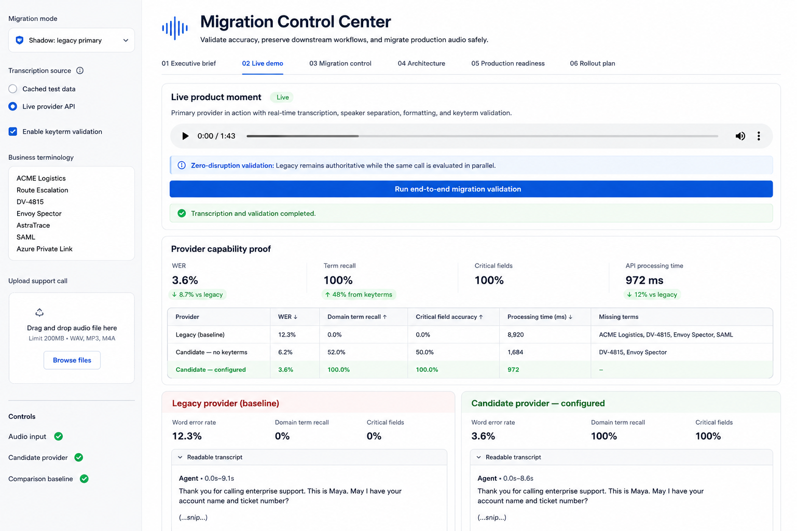

# Voice AI Migration & Evaluation Workbench

A provider-neutral portfolio project for evaluating speech-to-text migrations, preserving downstream contracts, and designing safe, reversible production rollouts.

The core operational question is: **how do you compare an incumbent and candidate speech-to-text system objectively without putting production workflows at risk?**

> **Portfolio note:** All scenarios, company names, terminology, transcripts, metrics, and evaluation data in this repository are fictional or synthetic. This repository does not contain customer data, proprietary implementation details, or hiring-assessment materials.

## Product preview



*Migration Control Center showing provider-neutral transcription evaluation, business-critical terminology validation, comparison metrics, and rollout-readiness signals.*

## What this project demonstrates

- Provider-neutral speech-to-text evaluation
- Human-reference Word Error Rate (WER)
- Business-critical terminology recall
- Stable transcript contracts between providers and downstream systems
- Baseline → shadow → canary → cutover rollout design
- Explicit quality, reliability, and rollback gates
- Synthetic data and offline tests that require no external service

## Architecture

```text
Audio / call recordings
        |
        v
   Traffic Router
   /           \
  v             v
Incumbent     Candidate
STT Adapter   STT Adapter
   \             /
    v           v
   Normalized Transcript Contract
              |
       +------+-------+
       |              |
       v              v
 Quality Engine   Downstream Adapter
       |              |
       v              v
 Evaluation       Existing workflow
 Dashboard
```

The provider-specific boundary is intentionally thin. Evaluation and downstream workflow logic consume a stable transcript contract, allowing providers to be compared or replaced without redesigning the rest of the system.

## Evaluation model

- **Word Error Rate (WER):** overall transcription accuracy against a human reference
- **Critical-term recall:** whether important domain terminology survives transcription
- **Critical-field accuracy:** whether values that drive downstream actions remain correct

A production evaluation would also segment latency, failure rate, cost, accents, noise conditions, languages, and call types.

## Rollout strategy

| Stage | Purpose |
|---|---|
| Baseline | Establish incumbent quality and operational behavior |
| Shadow | Evaluate the candidate in parallel without affecting production output |
| Canary | Route a controlled subset to the candidate with explicit rollback gates |
| Expand | Increase traffic only after quality and reliability criteria remain stable |
| Cutover | Make the candidate primary while retaining rollback until operationally stable |

## Run locally

```bash
python -m venv .venv
source .venv/bin/activate
pip install -r requirements.txt
pytest -q
python run_eval.py
streamlit run app.py
```

The offline evaluation works immediately using synthetic data. A generic optional HTTP adapter is included for connecting a candidate STT service without coupling the project to a particular vendor.

## Repository structure

```text
app.py                    Streamlit evaluation dashboard
run_eval.py               Offline evaluation CLI
src/evaluation.py         Provider-neutral metrics
src/stt_provider.py       Generic optional HTTP STT adapter
data/sample_eval_cases.json
                          Synthetic evaluation cases
docs/rollout_strategy.md  Production rollout framework
tests/test_evaluation.py  Unit tests
.github/workflows/ci.yml  CI validation
```

## Production hardening

A production implementation would add durable queues/object storage, async processing, retries and dead-letter handling, encrypted secrets, PII-aware logging, tracing, feature flags, load testing, p95/p99 SLOs, automated rollback, and a human-reviewed evaluation dataset.

## Why I built it

Voice-model migrations are not just model-selection exercises. The hard part is defining what quality means for the workflow, comparing systems on representative data, preserving downstream contracts, and introducing change without creating unnecessary production risk. This project makes that deployment reasoning visible in a small runnable implementation.

— Anastasia Chueva
